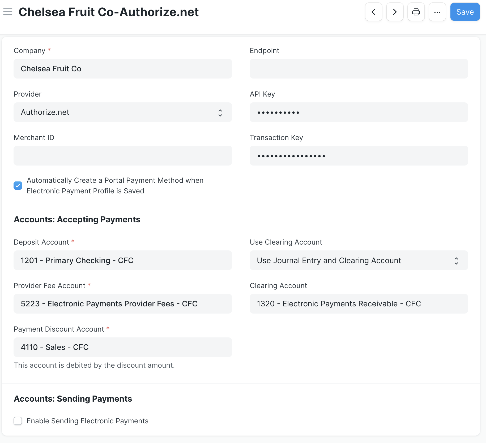

# Electronic Payments Configuration and Settings

One Electronic Payment Settings document may be created for each Company in ERPNext. This document stores the Provider information (including API keys) and account information that's used in the chosen accounting workflow. Authorize.net requires both an API Key and a Transaction Key, whereas Stripe requires only the API Key. The keys should be the **testing/sandbox** values when testing the functionality of the application, and only updated to live keys when using the application in production.

See below for information and default values for each field:

- **Company:** (required) the company in ERPNext to apply all settings to - only one Electronic Payment Settings document may exist per company
- **Provider:** Authorize.net or Stripe
- **Merchant ID:** (optional) the company's ID associated with the provider
- **API Key:** the company's API key with the given provider. These should be the sandbox key (Authorize.net) or the test keys (Stripe, the account should also be in test mode) when testing the application, and the live keys when in production
- **Transaction Key:** (Authorize.net only) the company's transaction key with Authorize.net
- **Automatically Create a Portal Payment Method when Electronic Payment Profile is Saved:** (default checked) when checked, if a desk user clicks the Electronic Payment button for an Order or Invoice, then enters payment information via the dialog box and selects to save the payment method, this automatically creates a Portal Payment Method for the party. When visiting the party's page, Portal Payment Methods are viewable and editable in the Electronic Payments tab

**Accounts: Accepting Payments**
- **Deposit Account:** the account that receives deposits from the provider after customer payments settle
- **Provider Fee Account:** the account to hold any provider fees associated with transactions
- **Payment Discount Account:** the account to net any payment discounts given to a customer (this field fetches the default payment discount account specified in Company Settings but is editable)
- **Use Clearing Account:** (default Use Journal Entry and Clearing Account) whether to account for a successful electronic payment via a Journal Entry and Clearing account, or a Payment Entry. The differences between the two workflows is detailed on the [Electronic Payments Permissions and Workflows page](./permissions.md)
- **Clearing Account:** account to use when the Use Journal Entry and Clearing Account option is selected. The accounting entries for an example transaction using a clearing account can be found on the [Electronic Payments Permissions and Workflows page](./permissions.md)

**Accounts: Sending Payments**

This feature is coming soon!
<!-- uncomment and update screen shot when feature is merged  
- **Enable Sending Electronic Payments:** (default unchecked) activate the ability for the given company to make electronic payments
- **Withdrawal Account:** the account that sends payments to the provider after supplier payment transactions settle
- **Payment Discount Account:** the account to net any payment discounts given to the company (this field fetches the default payment discount account specified in Company Settings but is editable)
- **Provider Fee Account:** the account to hold any provider fees associated with transactions
- **Clearing Account:** account to use when the Use Journal Entry and Clearing Account option is selected. The accounting entries for an example transaction using a clearing account can be found on the [Electronic Payments Permissions and Workflows page](./permissions.md)
-->
