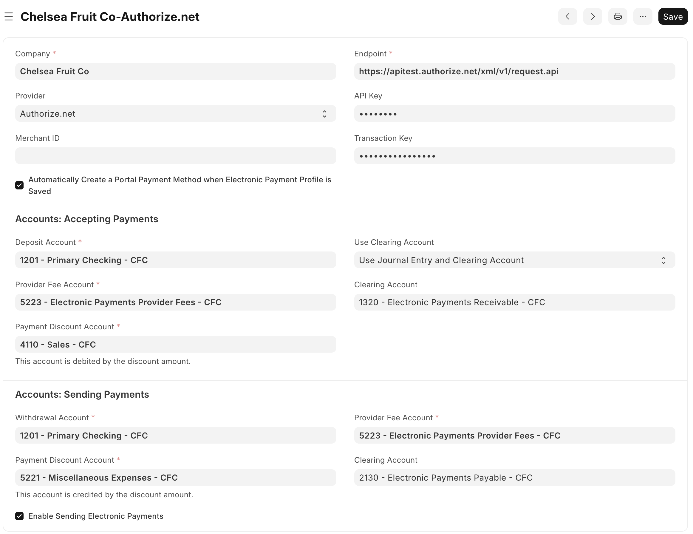
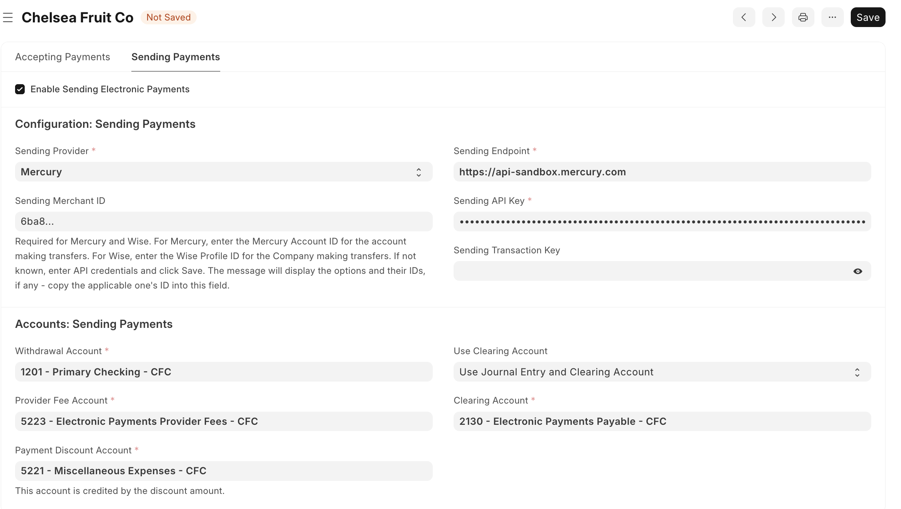

<!-- Copyright (c) 2025, AgriTheory and contributors
For license information, please see license.txt-->

# Electronic Payments Configuration and Settings

One Electronic Payment Settings document may be created for each Company in ERPNext. This document stores the provider credentials (including API keys) and selected accounts that are used in the chosen accounting workflow. Certain fields are required depending on the provider, which are noted below. The keys should be the **testing/sandbox** values when testing the functionality of the application, and only updated to live keys when using the application in production.

Authorize.net and Mercury also require an endpoint, which is different for their testing sandbox calls and real production ones.

Authorize.net requires both an API Key and a Transaction Key, whereas Stripe and Mercury require only the API Key.

See below for information and default values for each field:

- **Company:** (required) the company in ERPNext to apply all settings to - only one Electronic Payment Settings document may exist per company
- **Automatically Create a Portal Payment Method when Electronic Payment Profile is Saved:** (default checked) when checked, if a desk user clicks the Electronic Payment button for an Order or Invoice, then enters payment information via the dialog box on behalf of a party and selects to save the payment method, this automatically creates a Portal Payment Method for the party. In ERPNext, Portal Payment Methods are viewable and editable in the Electronic Payments tab of the respective party's page, or by the party when they log into the portal

**Configuration: Accepting Payments**
- **Provider:** Authorize.net or Stripe - this is the provider to **accept** electronic payments and may be different than the one used to send payments
- **Merchant ID:** (optional) the company's ID associated with the provider
- **Endpoint:** (required for Authorize.net) Authorize.net has two distinct API endpoints
    - In testing: use the sandbox API endpoint `https://apitest.authorize.net/xml/v1/request.api`
    - Production mode: use the production API endpoint `https://api.authorize.net/xml/v1/request.api`
    - Note that for Authorize.net, sandbox keys only work with the sandbox endpoint, and production keys only work with the production endpoint. The user will see an error if the keys don't match with the appropriate endpoint
- **API Key:** (required) the company's API key with the given provider
    - In testing: this should be the sandbox key for Authorize.net or the test keys for Stripe (the Stripe account should also be in test mode) when testing the application
    - In production: this should be the live production keys when being used in a production environment
- **Transaction Key:** (required for Authorize.net) the company's transaction key with Authorize.net
    - In testing: this should be the sandbox transaction key
    - In production: this should be the live transaction key

**Accounts: Accepting Payments**
- **Deposit Account:** the account that receives deposits from the provider after customer payments settle
- **Provider Fee Account:** the account to hold any provider fees associated with transactions
- **Payment Discount Account:** the account to net any payment discounts given to a customer (this field fetches the default payment discount account specified in Company Settings but is editable)
- **Use Clearing Account:** (default Use Journal Entry and Clearing Account) whether to account for a successful electronic payment via a Journal Entry and Clearing account, or a Payment Entry. The differences between the two workflows is detailed on the [Electronic Payments Permissions and Workflows page](./permissions.md)
- **Clearing Account:** (required if Use Journal Entry and Clearing Account is selected) the account to use when the Use Journal Entry and Clearing Account option is selected. The accounting entries for an example transaction using a clearing account can be found on the [Electronic Payments Permissions and Workflows page](./permissions.md)

The following fields pertain to sending electronic payments and are found on the "Sending Payments" tab. Note that any field marked as "required" is only required if this feature is enabled.

- **Enable Sending Electronic Payments:** (default unchecked) activate the ability for the given company to send electronic payments

**Configuration: Sending Payments**
- **Sending Provider:** (required) Authorize.net or Mercury - this is the provider to **send** electronic payments and may be different than the one used to accept payments
- **Merchant ID:** (required for Mercury) the Mercury Account ID for the account in Mercury that is making the payment transfers. This is not easily discoverable in the Mercury UI, for a list of options, leave this blank and fill in the other required fields (particularly the API endpoint and keys). When you click Save, it will call the API and list all the accounts associated with the given credentials
- **Endpoint:** (required) both Authorize.net and Mercury have two distinct API endpoints - please refer to their respective documentation ([Mercury API reference](), [Authorize.net API reference](https://developer.authorize.net/api/reference/index.html#gettingstarted-section-section-header)) for the most up-to-date values for endpoints.
    - In testing Authorize.net, use the sandbox API endpoint: `https://apitest.authorize.net/xml/v1/request.api`
    - Production mode for Authorize.net, use the production API endpoint: `https://api.authorize.net/xml/v1/request.api`
    - In testing Mercury, use the sandbox API endpoint: `https://api-sandbox.mercury.com`
    - Production mode for Mercury, use the production API endpoint: `https://api.mercury.com`
    - Note that for both Authorize.net and Mercury, the sandbox keys only work with the sandbox endpoint, and production keys only work with the production endpoint. The user will see an error if the keys don't match with the appropriate endpoint
- **API Key:** (required) the company's API key with the given provider
    - In testing: this should be the sandbox key
    - In production: this should be the live production key
- **Transaction Key:** (required for Authorize.net) the company's transaction key
    - In testing: this should be the sandbox transaction key
    - In production: this should be the live transaction key

**Accounts: Sending Payments**
- **Withdrawal Account:** the account that sends payments to the provider to fund transfers
- **Payment Discount Account:** the account to net any payment discounts given to the company (this field fetches the default payment discount account specified in Company Settings but is editable)
- **Provider Fee Account:** the account to hold any provider fees associated with transactions
- **Clearing Account:** (required if Use Journal Entry and Clearing Account is selected) the account to use when the Use Journal Entry and Clearing Account option is selected. The accounting entries for an example transaction using a clearing account can be found on the [Electronic Payments Permissions and Workflows page](./permissions.md)
