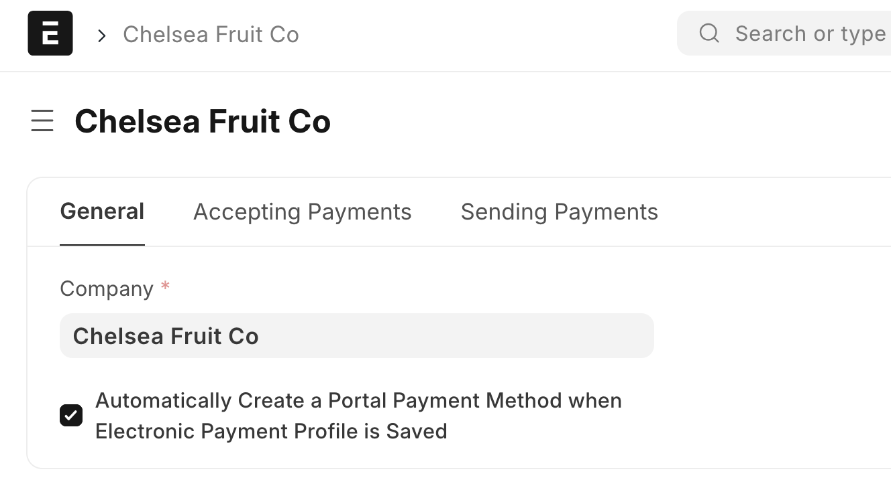
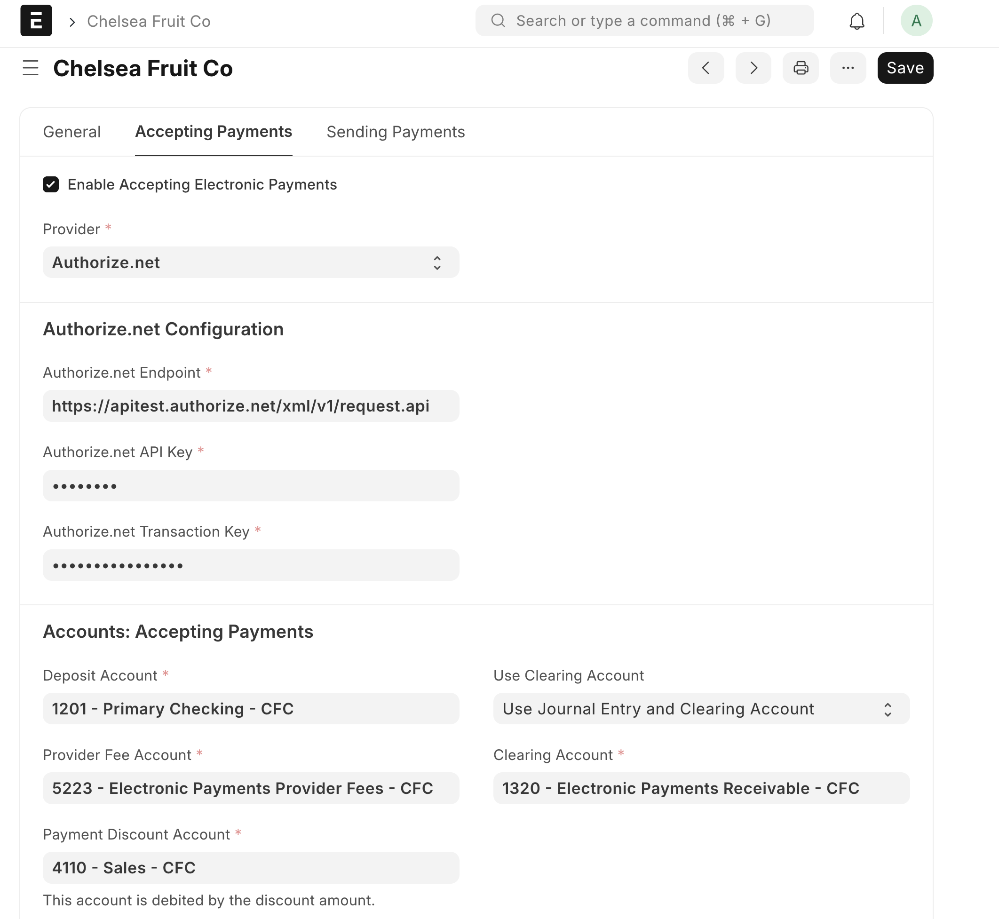
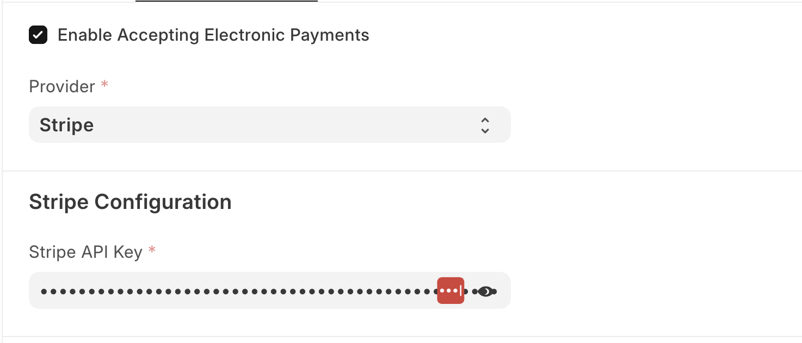
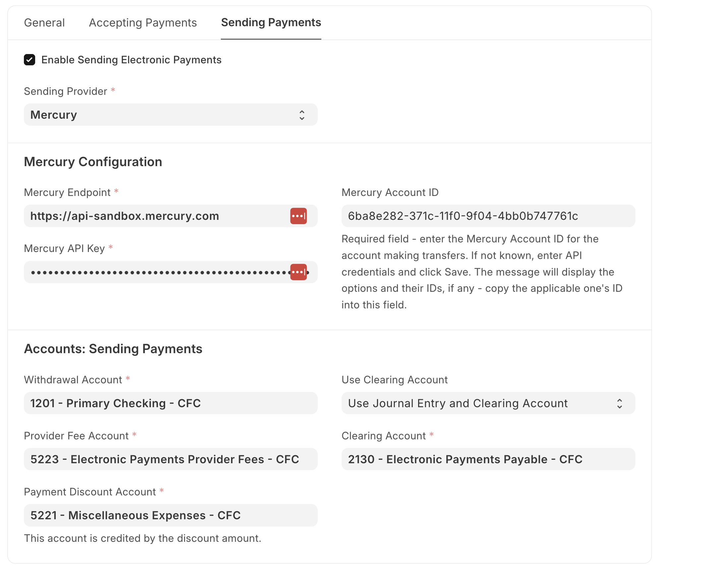
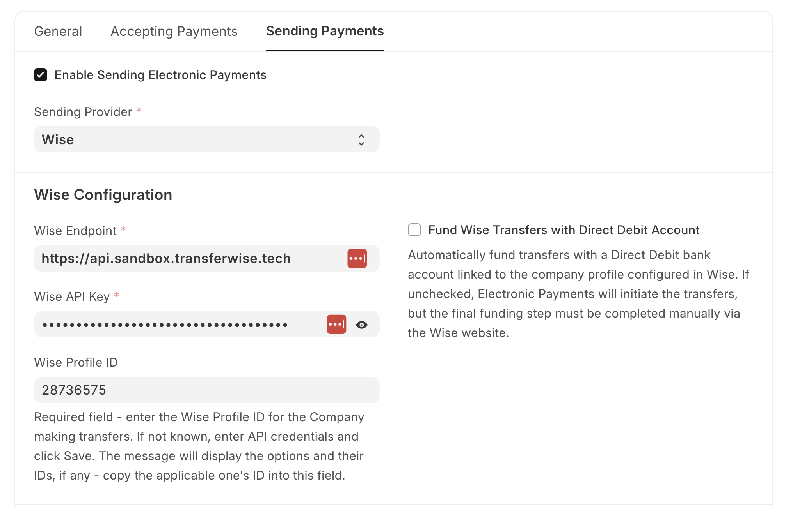

<!-- Copyright (c) 2025, AgriTheory and contributors
For license information, please see license.txt-->

# Electronic Payments Configuration and Settings

One Electronic Payment Settings document may be created for each Company in ERPNext. This document stores the provider credentials (including API keys) and selected accounts that are used in the chosen accounting workflow. Certain fields are required depending on the provider, which are noted below. The keys should be the **testing/sandbox** values when testing the functionality of the application, and only updated to live keys when using the application in production.

Some provider configurations require an endpoint, which is different for their testing sandbox calls and real production ones.

See below for information and default values for each field.

## General Settings

- **Company:** (required) the company in ERPNext to apply all settings to - only one Electronic Payment Settings document may exist per company
- **Automatically Create a Portal Payment Method when Electronic Payment Profile is Saved:** (default checked) when checked, if a desk user clicks the Electronic Payment button for an Order or Invoice, then enters payment information via the dialog box on behalf of a party and selects to save the payment method, this automatically creates a Portal Payment Method for the party. In ERPNext, Portal Payment Methods are viewable and editable in the Electronic Payments tab of the respective party's page, or by the a user associated with that party (via a Contact) when they log into the portal

## Configuration: Accepting Payments

The following fields pertain to accepting electronic payments and are found on the "Accepting Payments" tab. Note that any field marked as "required" is only required if this feature is enabled. Also, there are provider-specific configuration fields that will differ, depending on the provider's API requirements.

- **Enable Accepting Electronic Payments:** (default unchecked) activate the ability for the given company to accept electronic payments
- **Provider:** Authorize.net or Stripe - this is the provider to **accept** electronic payments and may be different than the one used to send payments

**Authorize.net Configuration**
- **Authorize.net Endpoint:** (required) Authorize.net has two distinct API endpoints, please refer to the documentation ([Authorize.net API reference](https://developer.authorize.net/api/reference/index.html#gettingstarted-section-section-header)) for the most up-to-date values for endpoints
    - In testing: use the sandbox API endpoint `https://apitest.authorize.net/xml/v1/request.api`
    - Production mode: use the production API endpoint `https://api.authorize.net/xml/v1/request.api`
    - Note that for Authorize.net, sandbox keys only work with the sandbox endpoint, and production keys only work with the production endpoint. The user will see an error if the keys don't match with the appropriate endpoint
- **Authorize.net API Key:** (required) the company's API key with Authorize.net
    - In testing: this should be the sandbox key for Authorize.net
    - In production: this should be the live production keys
- **Authorize.net Transaction Key:** (required) the company's transaction key with Authorize.net
    - In testing: this should be the sandbox transaction key
    - In production: this should be the live transaction key

**Stripe Configuration**

- **Stripe API Key:** (required) the company's API key with Stripe
    - In testing: this should be the test keys for Stripe (the Stripe account should also be in test mode)
    - In production: this should be the live production keys

**Accounts: Accepting Payments**
- **Deposit Account:** (required) the account that receives deposits from the provider after customer payments settle
- **Provider Fee Account:** (required) the account to hold any provider fees associated with transactions
- **Payment Discount Account:** (required) the account to net any payment discounts given to a customer (this field fetches the default payment discount account specified in Company Settings but is editable)
- **Use Clearing Account:** (default Use Journal Entry and Clearing Account) whether to account for a successful electronic payment via a Journal Entry and Clearing account, or a Payment Entry. The differences between the two workflows is detailed on the [Electronic Payments Permissions and Workflows page](./permissions.md)
- **Clearing Account:** (required if Use Journal Entry and Clearing Account is selected) the account to use when the Use Journal Entry and Clearing Account option is selected. The accounting entries for an example transaction using a clearing account can be found on the [Electronic Payments Permissions and Workflows page](./permissions.md)

## Configuration: Sending Payments

The following fields pertain to sending electronic payments and are found on the "Sending Payments" tab. Note that any field marked as "required" is only required if this feature is enabled.

- **Enable Sending Electronic Payments:** (default unchecked) activate the ability for the given company to send electronic payments
- **Sending Provider:** (required) Authorize.net, Mercury, or Wise - this is the provider to **send** electronic payments and may be different than the one used to accept payments

Note that for all providers, the sandbox keys only work with the sandbox endpoint, and production keys only work with the production endpoint. The user will see an error if the keys don't match with the appropriate endpoint.

**Authorize.net Configuration**
The configuration fields are the same as in the Accepting Payments tab - refer to that section above for details.

**Mercury Configuration**
- **Mercury Endpoint:** (required) Mercury has two distinct API endpoints, please refer to the documentation ([Mercury API reference](https://docs.mercury.com/reference/welcome-to-mercury-api)) for the most up-to-date values for endpoints
    - In testing: use the sandbox API endpoint `https://api-sandbox.mercury.com`
    - In production: use the production API endpoint `https://api.mercury.com`
- **Mercury API Key:** (required) the company's API key with Mercury
    - In testing: this should be the sandbox key
    - In production: this should be the live production key
- **Mercury Account ID:** (required) this is the Account ID for the account in Mercury that is making the payment transfers. This is not easily discoverable in the Mercury UI, for a list of options, leave this blank and fill in the other required fields (particularly the API endpoint and keys). When you click Save, it will call the API and list all the accounts associated with the given credentials. Paste the ID value for the appropriate one in this field

**Wise Configuration**

- **Wise Endpoint:** (required) Wise has two distinct API endpoints, please refer to the documentation ([Wise API reference](https://docs.wise.com/api-docs/api-reference/environments)) for the most up-to-date values for endpoints
    - In testing, use the appropriate sandbox API endpoint:
        - `https://api-mtls.sandbox.transferwise.tech` (mTLS enabled)
        - `https://api.sandbox.transferwise.tech` (TLS only)
    - In production, use the appropriate production API endpoint:
        - `https://api-mtls.transferwise.com` (mTLS enabled)
        - `https://api.wise.com` (TLS only)
- **Wise API Key:** (required) the company's API key with Wise
    - In testing: this should be the sandbox key
    - In production: this should be the live production key
- **Wise Profile ID:** (required) this is the Profile ID for the company in Wise that will be associated with payment transfers. This is not easily discoverable in the Wise UI, for a list of options, leave this blank and fill in the other required fields (particularly the API endpoint and keys). When you click Save, it will call the API and list all the profiles associated with the given credentials. Paste the ID value for the appropriate one in this field
- **Fund Wise Transfers with Direct Debit Account:** (default unchecked) check this box if the Wise account has a Direct Debit account set up and you want transfers automatically funded. This is currently the only way to fund a transfer via the API, if unchecked, Electronic Payments will initiate the transfers, but the final funding step must be completed manually via the Wise website
- **Wise Linked Bank Account ID** (required if Fund Wise Transfers with Direct Debit Account is checked) this is the Direct Debit bank account's Account ID in Wise. This is not easily discoverable in the Wise UI, for a list of options, leave this blank and fill in the other required fields (particularly the API endpoint and keys). When you click Save, it will call the API and list all the account IDs associated with the given credentials. Paste the ID value for the appropriate one in this field
- **Wise Bank Account Type** (required if Fund Wise Transfers with Direct Debit Account is checked) either Checking or Savings, this is the account type of the linked account
- **Wise Bank Account Currency** (required if Fund Wise Transfers with Direct Debit Account is checked) the currency of the linked account, currently only USD is supported

**Accounts: Sending Payments**
- **Withdrawal Account:** (required) the account that sends payments to the provider to fund transfers
- **Provider Fee Account:** (required) the account to hold any provider fees associated with transactions
- **Payment Discount Account:** (required) the account to net any payment discounts given to the company (this field fetches the default payment discount account specified in Company Settings but is editable)
- **Use Clearing Account:** (default Use Journal Entry and Clearing Account) whether to account for a successful electronic payment via a Journal Entry and Clearing account, or a Payment Entry. The differences between the two workflows is detailed on the [Electronic Payments Permissions and Workflows page](./permissions.md)
- **Clearing Account:** (required if Use Journal Entry and Clearing Account is selected) the account to use when the Use Journal Entry and Clearing Account option is selected. The accounting entries for an example transaction using a clearing account can be found on the [Electronic Payments Permissions and Workflows page](./permissions.md)

## Managing Payment Methods for Customers and Suppliers in a Multi-Company ERPNext Instance

ERPNext does not link a Company to Customers, Suppliers, Users, or Contacts. In a single-Company ERPNext instance, this won't be cause for any issues using Electronic Payments.

However, in a multi-Company ERPNext instance (assuming each Company has its own provider account, API keys, and Electronic Payment Settings document), if a Customer or Supplier contact uses the Portal to add an electronic payment method, this can raise an issue of which Company's provider account to use to store the payment method.

When a portal user adds a payment method, the app loops over all valid Electronic Payment Settings and adds the payment method in each Setting's company's provider. A valid Electronic Payment Settings document is when the "Enable Accepting" box is checked when the portal user is associated with a customer or the "Enable Sending" box is checked when the portal user is associated with a supplier.

Note that this behavior only occurs when a portal user adds their payment information and not when it's collected on the desk side through the Electronic Payments dialog box in the Purchase or Sales document. Those documents have a Company field, which the app uses to get the correct Electronic Payment Settings provider and credentials.
