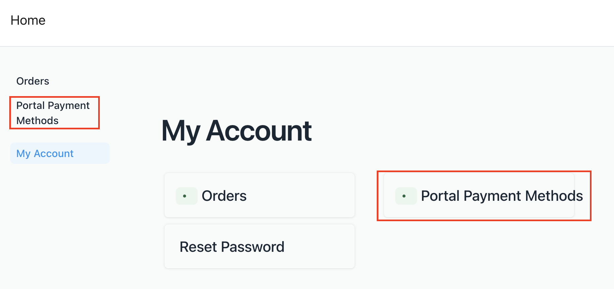
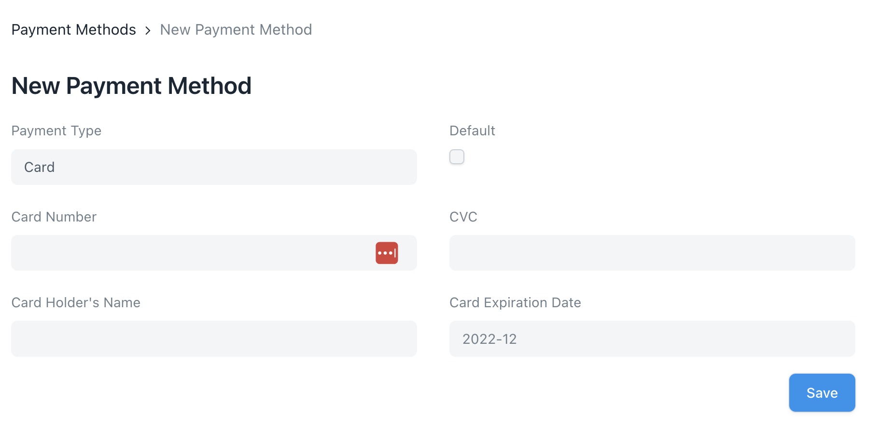
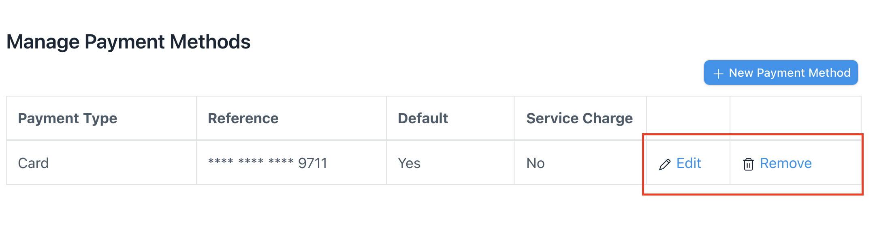
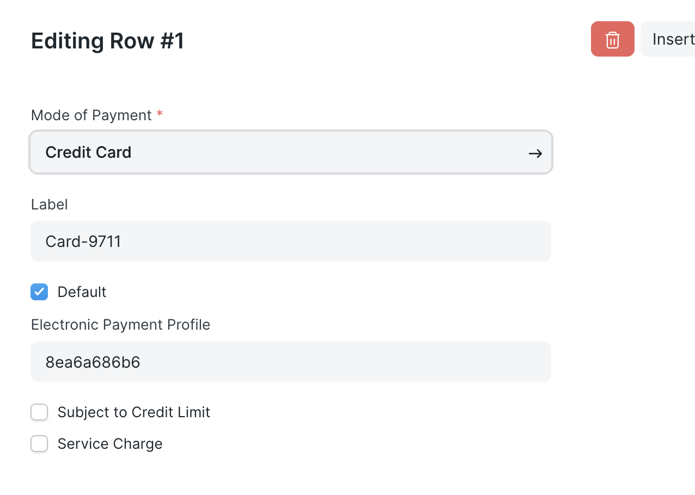
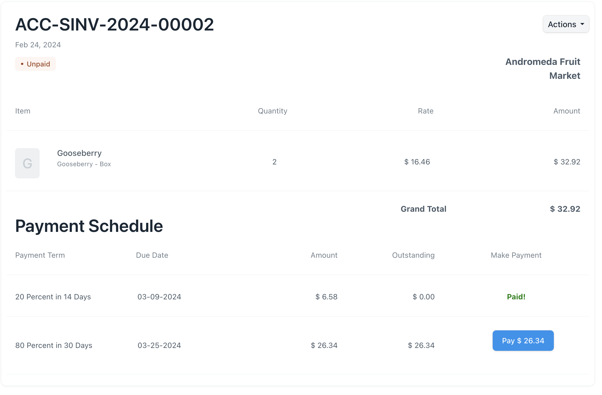
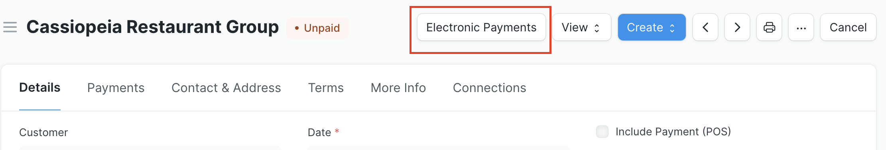
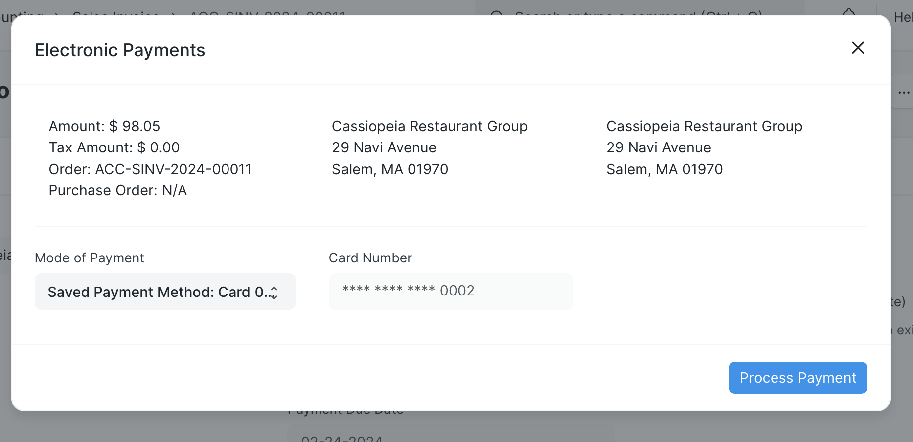

# Electronic Payments Documentation

The Electronic Payments application extends ERPNext[^1] with the capability to send and receive electronic payments via several vendors directly in the system. The current supported vendors (also called providers) are [Authorize.net](www.authorize.net) and, with some limitations (detailed in the Provider Limitations section), [Stripe](stripe.com). The current providers each have their own terms and conditions they require to use their services, including authorization requirements for certain payment methods. Before installing and using the Electronic Payments app, it is your responsibility to comply with your provider's terms, conditions, and requirements for using their services.

## Installation, Configuration, Settings, and Permissions

There are a few prerequisite steps to get the Electronic Payments application up and running on your ERPNext site. See the following pages for details on installation, configuration, settings, and permissions:

- [Installation Guide](../README.md)
- [Configuration and Settings](./configuration.md)
- [Default Permissions and Accounting Workflows](./permissions.md)
- Refer to the [Example Data page](./exampledata.md) for instructions around installing fictitious demo data to experiment with using the Electronic Payments app

## App Feature Overview

Once the app is installed and configured, you can begin utilizing its features.

Electronic Payments is set up to allow portal users to log in and add credit card and ACH payment methods associated with their account. Credit card payment methods are available to add for customers (not suppliers) using either Authorize.net or Stripe. ACH payment methods are only available with Authorize.net, must be a checking account, and may be added for suppliers (the account they'll receive a payment into) or customers. The payment amount currency for a transaction will use the ERPNext instance's global default, however, [Authorize.net's eCheck user guide documentation](https://www.authorize.net/content/dam/documents/en/echeck-user-guide.pdf) specifies that eCheck services process transactions only in US dollars. It's your responsibility to ensure the Electronic Payments application only processes appropriate transactions.

Note that the payment method details are never saved on your system at any point. The app immediately passes the data to the provider API and, if the API successfully creates a payment method, it only saves the provider's token and last few account or card digits to identify that payment method.

The portal also allows the customer or supplier to remove or edit a saved payment method. When making changes to an existing method, they must re-enter all information, since it's not stored in ERPNext and providers don't allow requests to retrieve payment method details.

There's an important consideration regarding the Electronic Payment Settings and payment methods being added via the portal. As noted in the [Configuration and Settings page](./configuration.md), Electronic Payment Settings are specified on a per-company basis. When a portal user adds a payment method, there's no way to associate it to a company, so the app uses the **default company** set in ERPNext to find the provider and API keys to use. This will link the payment method to the default company's provider account. For this reason, an Electronic Payments Settings document should always exist for the default company.

In the desk view, stored payment methods are visible on the Electronic Payments tab in that party's page.

Some payment method details may be edited from this view - if the party is subject to a credit limit, or if there are service charges that should be added when the party uses that payment method, those are configurable in the table.

When the customer is logged into the portal and has one or more payment methods set up, they can make a payment on an Order or Invoice directly from the portal. The app automatically integrates with the payment schedule defined on the Terms tab of the document, and will display payments spit out by payment term and showing any valid discounted amounts and due dates as necessary.

If the provider accepts the payment and returns a success message, the app creates a Journal Entry or Payment Entry (depending how the Electronic Payment Settings are configured) and updates the payment schedule.

The app also allows a desk user to make an advance payment on a Sales Order or a payment on a Sales Invoice on a customer's behalf. If sending payments is enabled in Electronic Payment Settings, and a supplier has authorized the use of a checking account to receive ACH payments, the desk user may also make a payment against a Purchase Order or Purchase Invoice. The document's page will show an Electronic Payment button which launches a dialog box to put the payment through.

## Provider Limitations

There are some limitations with using Stripe as a provider. First, only credit card payment methods (not ACH ones) are configurable. Stripe uses its own mandate workflow (to verify that the customer allows making a charge to their bank account) that is currently not supported by the app. Second, given that sending payments to suppliers is only possible via an ACH payment method, that feature isn't available for Stripe.

## Sending Payments in Test Mode with Authorize.net

The Authorize.net sandbox is useful tool to test the functionality and feature set of the Electronic Payments app before going live. However, the sandbox doesn't support eCheck Settlement, therefore you will encounter API errors if trying to test bank account refunds or making an ACH payment to a supplier.

## Code Contributions and Adding a Provider

The Electronic Payments app maintainers welcome contributions to expand provider options beyond Stripe and Authorize.net. To be considered, a provider should have a comparable feature set to those of Authorize.net, including receiving credit card payments and sending and receiving ACH payments. Feature requests and pull requests can be made on the [app's GitHub repository](https://github.com/agritheory/electronic_payments).

[^1]: [ERPNext](https://erpnext.com/) is an open-sourced Enterprise Resource Planning (ERP) software that provides a wide range of business management functionality. Its core features include support for accounting, inventory, manufacturing, customer relationship management (CRM), distribution, and retail.
