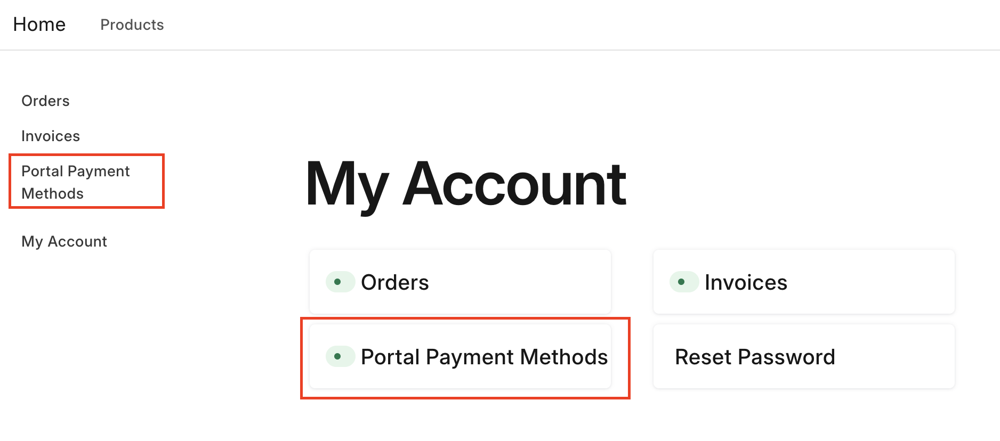
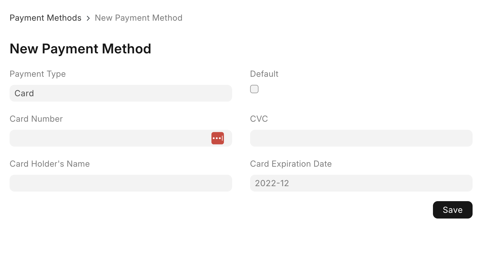
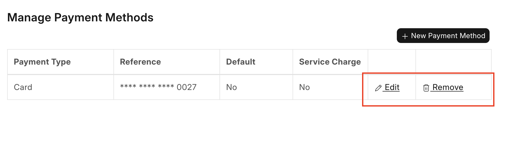
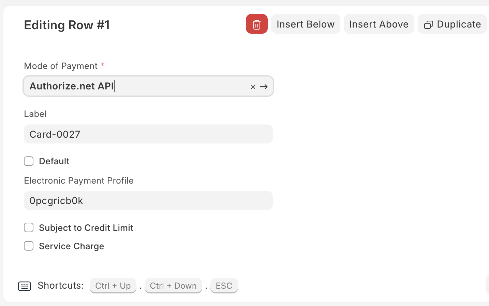
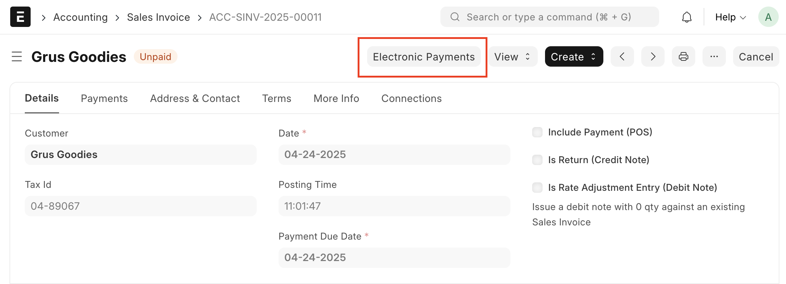
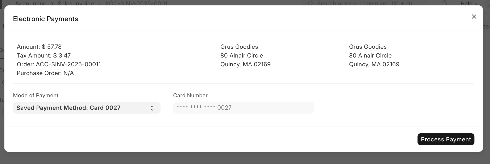

<!-- Copyright (c) 2025, AgriTheory and contributors
For license information, please see license.txt-->

# Electronic Payments Documentation

  AgriTheory 2025-11-03

The Electronic Payments application extends ERPNext[^1] with the capability to send and receive electronic payments via several vendors directly in the system. The current supported vendors (also called providers) are [Authorize.net](www.authorize.net) (accepting and sending payments), [Stripe](stripe.com) (accepting payments, with some limitations detailed in the Provider Limitations section), [Mercury](mercury.com) (sending payments), and [Wise](wise.com) (sending payments). You can configure the app to use different providers to accept vs send payments.

The current providers each have their own terms and conditions they require to use their services, including authorization requirements for certain payment methods. Before installing and using the Electronic Payments app, it is your responsibility to comply with your provider's terms, conditions, and requirements for using their services.

## Installation, Configuration, Settings, and Permissions

There are a few prerequisite steps to get the Electronic Payments application up and running on your ERPNext site. See the following pages for details on installation, configuration, settings, and permissions:

- [Installation Guide](../README.md)
- [Configuration and Settings](./configuration.md)
- [Default Permissions and Accounting Workflows](./permissions.md)
- Refer to the [Example Data page](./exampledata.md) for instructions around installing fictitious demo data to experiment with using the Electronic Payments app

## App Feature Overview

Once the app is installed and configured, you can begin utilizing its features.

Electronic Payments is set up to allow portal users to log in and add credit card and ACH payment methods associated with their account. Credit card payment methods are available to add for customers (not suppliers) using either Authorize.net or Stripe. ACH payment methods are available with Authorize.net, Mercury, or Wise, must be a checking account, and may be added for suppliers (the account they'll receive a payment into) or customers.

The payment amount currency for a transaction will use the ERPNext instance's global default, however, [Authorize.net's eCheck user guide documentation](https://www.authorize.net/content/dam/documents/en/echeck-user-guide.pdf) specifies that eCheck services process transactions only in US dollars. It's your responsibility to ensure the Electronic Payments application only processes appropriate transactions. Mercury and Wise have the capability to make transfers in a variety of currencies, however the application currently only supports transfers to US accounts.

Note that the payment method details are never saved on your system at any point. The app immediately passes the data to the provider API and, if the API successfully creates a payment method, it only saves the provider's token and last few account or card digits to identify that payment method.

The portal also allows the customer or supplier to remove and in some cases edit a saved payment method. When making changes to an existing method, they may be required to re-enter all information, since it's not stored in ERPNext and different providers may not allow requests to retrieve payment method details. Wise does not support editing account information once it's in their system - the supplier will need to remove and re-add their account information if they need to make changes.

There's an important consideration regarding the Electronic Payment Settings and payment methods being added via the portal. As noted in the [Configuration and Settings page](./configuration.md), Electronic Payment Settings are specified on a per-company basis. When a portal user adds a payment method, there's no built-in way in ERPNext to associate it to a Company. In this case, the app creates it for all companies with an Electronic Payment Settings document if the document has "Enable Accepting" checked (when it's a customer adding a payment method) or "Enable Sending" checked (when it's a supplier adding a payment method).

In the desk view, stored payment methods are visible on the Electronic Payments tab in that party's page.

Some payment method details may be edited from this view - if the party is subject to a credit limit, or if there are service charges that should be added when the party uses that payment method, those are configurable in the table.

When the customer is logged into the portal and has one or more payment methods set up, they can make a payment on an Order or Invoice directly from the portal. The app automatically integrates with the payment schedule defined on the Terms tab of the document, and will display payments spit out by payment term and showing any valid discounted amounts and due dates as necessary.

If the provider accepts the payment and returns a success message, the app creates a Journal Entry or Payment Entry (depending how the Electronic Payment Settings are configured) and updates the payment schedule.

The app also allows a desk user to make an advance payment on a Sales Order or a payment on a Sales Invoice on a customer's behalf, or send an advance payment on a Purchase Order or payment on a Purchase Invoice to a supplier. The Order's or Invoice's page will show an Electronic Payment button which launches a dialog box that may be used to save new payment details, save payment details and process a payment, or process a payment from a saved method.

## Provider Limitations

**Stripe**
There are some limitations with using Stripe as a provider. First, only credit card payment methods (not ACH ones) are configurable. Stripe uses its own mandate workflow (to verify that the customer allows making a charge to their bank account) that is currently not supported by the app. Second, given that sending payments to suppliers is only possible via an ACH payment method, Stripe does not show as a provider option for sending payments.

**Mercury**
Currently, Mercury only allows for ACH transfers via their API. Other transfer types are possible, but they must be executed through the Mercury website. Mercury also doesn't allow for deleting a payment method via the API. Any delete actions only remove it from ERPNext, but the user must log into their Mercury account and manually remove it there as well.

**Wise**
The final step in a Wise transfer process is for the user to tell Wise which method they'd like to use to fund the transfer. If done in the Wise website, it will show that user's available funding options depending on what's configured - these may include using funds in their Wise account, using a linked bank account, or sending a bank wire. However, the Wise API offers limited options to specify how the transfer should be funded to comply with UK and EEA regulations. Currently, the only option is to fund transfers via direct debit account, if it's set up in Wise. If not, the user can set up the transfers with the Electronic Payments app, but will need to complete the final funding step through their account on the Wise website.

## Sending Payments in Test Mode with Authorize.net

The Authorize.net sandbox is useful tool to test the functionality and feature set of the Electronic Payments app before going live. However, the sandbox doesn't support eCheck Settlement, therefore you will encounter API errors if trying to test bank account refunds or making an ACH payment to a supplier.

## Integration with the Check Run Application

The app integrates with the open source [Check Run](https://github.com/agritheory/check_run/tree/version-15) application, which is a payables utility for ERPNext. If a Check Run includes transactions with a mode of payment of "[Sending Provider] ACH", it will show a button to process those payments with the sending provider once the Check Run is submitted. When clicked, it triggers a transfer to the respective party for the given amount through the sending provider's API.

On a successful transaction, the transaction ID gets stored in the Payment Entry's Reference No field. In the event of an unsuccessful transaction, the details are saved to the Error Log. The user will see either a success message or any errors at the top of the Check Run once the payments are done processing.

The following configuration is required for the Check Run integration:
- An Electronic Payments Settings document exists for the company the Check Run is for, and it has sending payments enabled
- At least one ACH electronic payment method exists for the party receiving the payment

The Check Run app includes a new field to set a Supplier's default mode of payment on the Accounting tab. Set this field to "[Sending Provider] ACH" to automatically see that Mode of Payment in the Check Run for the given Supplier.

## Code Contributions and Adding a Provider

The Electronic Payments app maintainers welcome contributions to expand provider options beyond Authorize.net, Stripe, Mercury, and Wise. To be considered, a provider should preferably have a comparable feature set to those of Authorize.net, including receiving credit card payments and sending and receiving ACH payments, but providers that only send or accept payments may also be considered. Feature requests and pull requests can be made on the [app's GitHub repository](https://github.com/agritheory/electronic_payments).

[^1]: [ERPNext](https://erpnext.com/) is an open-sourced Enterprise Resource Planning (ERP) software that provides a wide range of business management functionality. Its core features include support for accounting, inventory, manufacturing, customer relationship management (CRM), distribution, and retail.
