<!-- Copyright (c) 2026, AgriTheory and contributors
For license information, please see license.txt-->

# Network Diagrams

  Heather Kusmierz 2026-02-25

The Electronic Payments app offers multiple ways to accomplish the same tasks in terms of adding, editing, or deleting payment methods, or applying one to pay an outstanding invoice. In general:

- **ERPNext User (via desk)** (with the appropriate permissions)
    - Add, edit, or delete payment methods from the Customer or Supplier record from the "Electronic Payments" tab. If there are multiple companies in ERPNext with Electronic Payments Settings configured, a new payment method will attach to all companies with "Accepting Payments" enabled (for Customers) or with "Sending Payments" enabled (for Suppliers)
    - Add and optionally apply a payment method or apply a saved payment method on a Sales Invoice or Purchase Invoice via the "Electronic Payments" button. The payment method will only attach to the company in the Invoice's "Company" field
- **Customer (self service via portal)**
    - Add, edit, or delete payment methods through the portal. If there are multiple companies in ERPNext with Electronic Payments Settings configured, a new payment method will attach to all companies with "Accepting Payments" enabled
    - Pay an outstanding Sales Invoice with a saved payment method
- **Supplier (self service via portal)**
    - Add, edit, or delete payment methods through the portal. If there are multiple companies in ERPNext with Electronic Payments Settings configured, a new payment method will attach to all companies with "Accepting Payments" enabled

Not all providers allow editing or deleting payment methods via their API - this is noted by provider.

Throughout all the following processes, ERPNext only stores the customer ID (if one is created), the payment method ID (the token the provider assigns to identify the payment method), and a payment method reference. This reference is a shorthand display (using the mode of payment and last four digits of the payment method, such as "Card-1234" or "ACH-6789") to help a user identify it.

For any unsuccessful interactions with the Provider API, ERPNext will display an error message and exit out of the process.

## Authorize.net

Authorize.net is available as a provider to both send or accept payments.

| Action | ERPNext Desk User | Customer Portal User | Supplier Portal User |
| :----: | :----------: | :------: | :------: |
| Add Pmt Method | ✅ | ✅ | ✅ |
| Edit Pmt Method | ✅ | ✅ | ✅ |
| Delete Pmt Method | ✅ | ✅ | ✅ |
| Pay Sales Invoice | ✅ | ✅ | ❌ |
| Pay Purchase Invoice | ✅ | ❌ | ❌ |

### Authorize.net: Adding a Portal Payment Method

The following diagram summarizes the interactions between a Customer or Supplier logged into the ERPNext portal and the provider's API when they add a new Portal Payment Method. These interactions with the API are identical to what an ERPNext desk user would experience if they added a payment method from the "Electronic Payments" tab in the Customer or Supplier record on behalf of the party.

Authorize.net generally saves payment methods to a customer profile. The diagram shows that this profile gets created first (if it's not already stored in ERPNext), then the new payment method gets linked to it.

In the loop below, the Electronic Payments Settings documents returned by the database are only those configured to accept payments (when a Customer is logged in) or to send payments (when a Supplier is logged in).

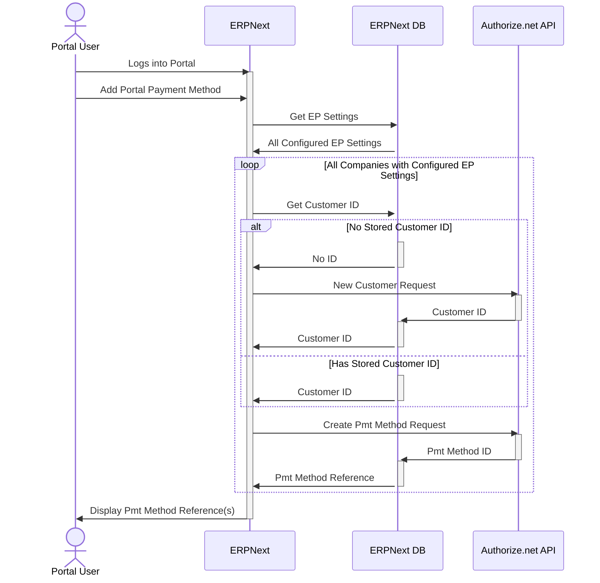

### Authorize.net: Editing a Portal Payment Method

The following diagram summarizes the interactions between a Customer or Supplier logged into the ERPNext portal when they want to edit a saved payment method. The form expects the Customer or Supplier to re-enter all payment method data to update it.

These interactions with the API are identical to what an ERPNext desk user would experience if they edited a payment method from the "Electronic Payments" tab in the Customer or Supplier record on behalf of the party.

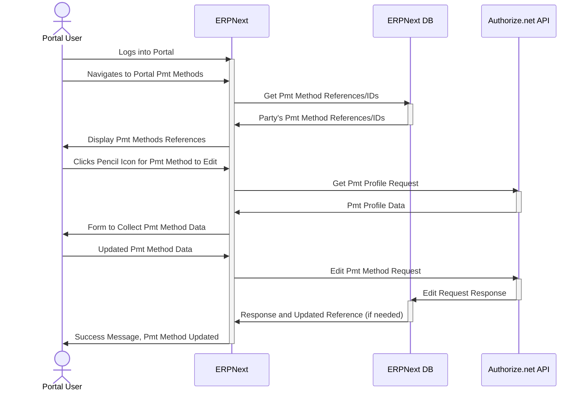

### Authorize.net: Deleting a Portal Payment Method

The following diagram summarizes the interactions between a Customer or Supplier logged into the ERPNext portal when they want to delete a saved payment method.

These interactions with the API are identical to what an ERPNext desk user would experience if they deleted a payment method from the "Electronic Payments" tab in the Customer or Supplier record on behalf of the party.

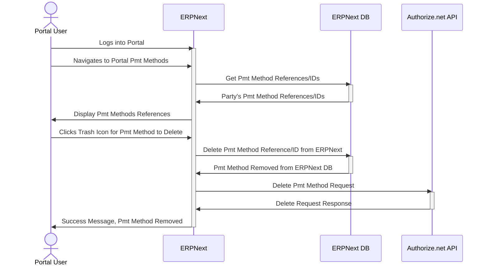

### Authorize.net: Applying a Portal Payment Method to Pay a Sales Invoice from the Portal

The following diagram summarizes the interactions between a Customer logged into the ERPNext portal when they want to apply a saved payment method to pay an outstanding Sales Invoice.

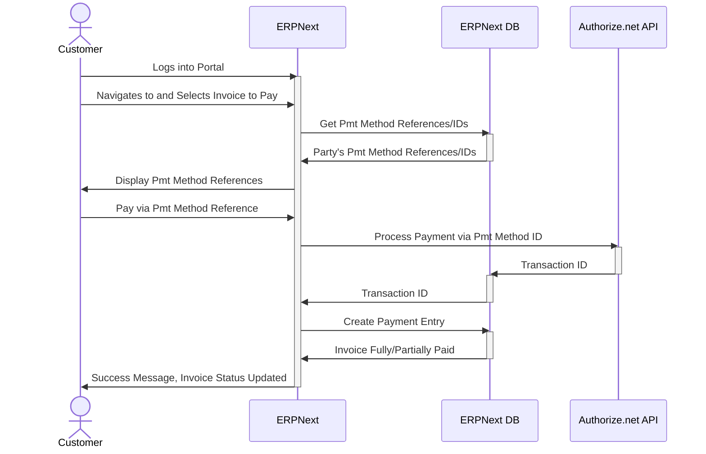

### Authorize.net: Applying a Portal Payment Method to Satisfy a Sales Invoice or Purchase Invoice as an ERPNext Desk User

The following diagram summarizes the interactions between an ERPNext desk user logged into ERPNext when they want to apply a party's saved payment method to accept payment for an outstanding Sales Invoice or send payment on an outstanding Purchase Invoice.

From the Invoice, the desk user can also add a new payment method and choose to save only, save and process payment, or only temporarily save until the payment goes through, then remove it from ERPNext.

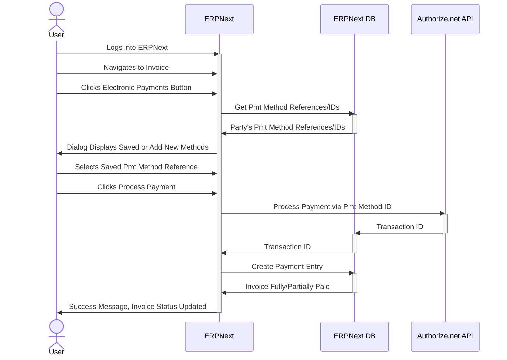

## Mercury

Mercury is available as a provider to send payments.

| Action | ERPNext Desk User | Customer Portal User | Supplier Portal User |
| :----: | :----------: | :------: | :------: |
| Add Pmt Method | ✅ | ❌ | ✅ |
| Edit Pmt Method | ✅ | ❌ | ✅ |
| Delete Pmt Method | 🟡 | ❌ | 🟡 |
| Pay Sales Invoice | ❌ | ❌ | ❌ |
| Pay Purchase Invoice | ✅ | ❌ | ❌ |

### Mercury: Adding a Portal Payment Method

The following diagram summarizes the interactions between a Supplier logged into the ERPNext portal and the Mercury API when they add a new Portal Payment Method. These interactions with the API are identical to what an ERPNext desk user would experience if they added a payment method from the "Electronic Payments" tab in the Supplier record on behalf of the party.

Mercury does not use profile IDs for a party. Instead, it creates independent "recipients" for each payment method. If a new payment method's bank account can accept both wire and ACH transfers, the user should select the "Routing number can accept wire transfers?" box. The app will automatically adjust the API call so the recipient has both modes of payment available. Note that wire transfers are only possible via the Mercury UI and not via the API yet.

### Mercury: Editing a Portal Payment Method

The following diagram summarizes the interactions between a Supplier logged into the ERPNext portal when they want to edit a saved payment method. The form expects the Supplier to re-enter all payment method data to update it.

These interactions with the API are identical to what an ERPNext desk user would experience if they edited a payment method from the "Electronic Payments" tab in the Supplier record on behalf of the party.

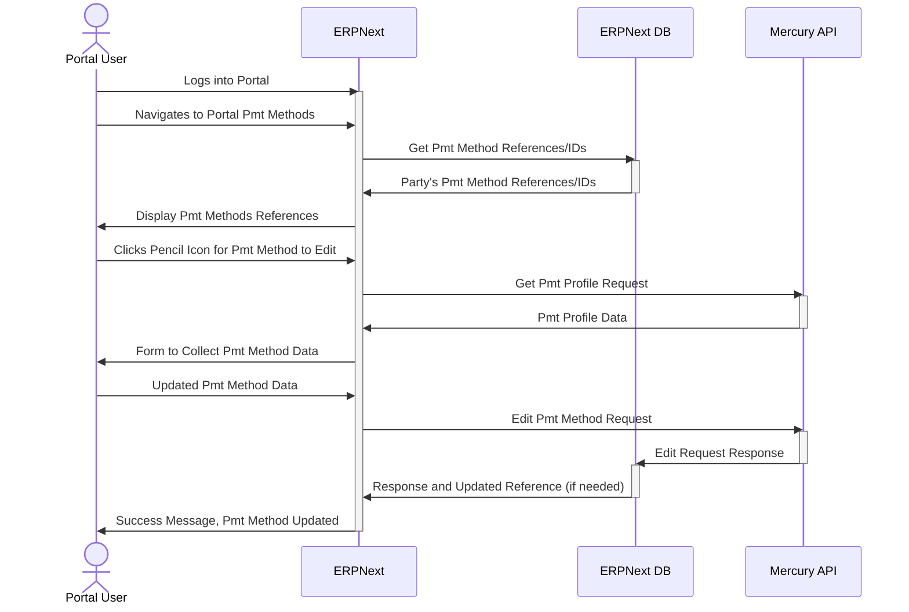

### Mercury: Deleting a Portal Payment Method

The following diagram summarizes the interactions between a Supplier logged into the ERPNext portal when they want to delete a saved payment method. The Mercury API does not allow for payment methods to be removed via an API call, so this action deletes it from ERPNext, then logs an error to let ERPNext desk users know to manually delete it from the Mercury website.

These interactions with the API are identical to what an ERPNext desk user would experience if they deleted a payment method from the "Electronic Payments" tab in the Supplier record on behalf of the party.

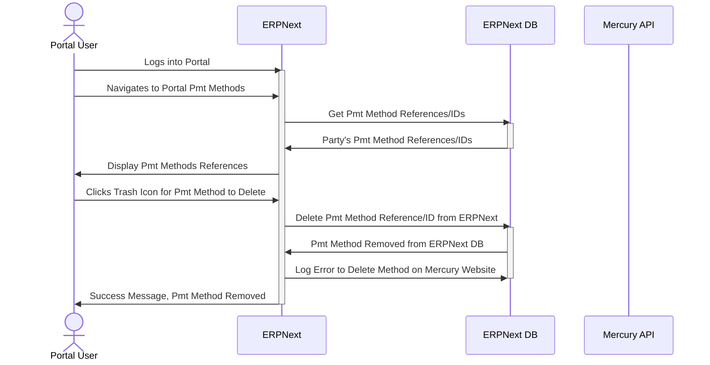

### Mercury: Send Payment to a Portal Payment Method to Pay a Purchase Invoice as an ERPNext Desk User

The following diagram summarizes the interactions between an ERPNext desk user logged into ERPNext when they want to send payment to a Supplier's saved payment method to pay an outstanding Purchase Invoice.

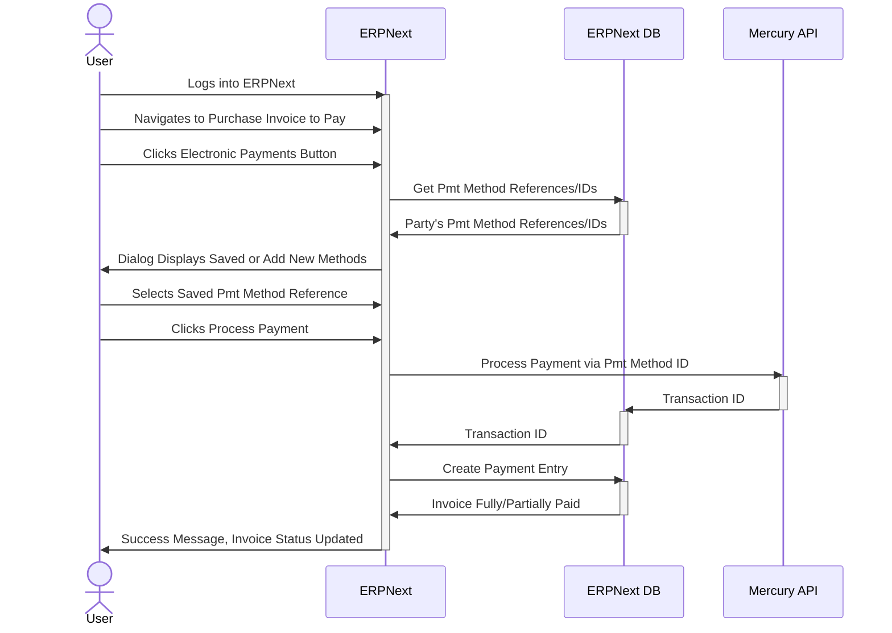

## Stripe

Stripe is available as a provider to accept payments.

| Action | ERPNext Desk User | Customer Portal User | Supplier Portal User |
| :----: | :----------: | :------: | :------: |
| Add Pmt Method | ✅ | ✅ | ❌ |
| Edit Pmt Method | ✅ | ✅ | ❌ |
| Delete Pmt Method | ✅ | ✅ | ❌ |
| Pay Sales Invoice | ✅ | ✅ | ❌ |
| Pay Purchase Invoice | ❌ | ❌ | ❌ |

### Stripe: Adding a Portal Payment Method

The following diagram summarizes the interactions between a Customer logged into the ERPNext portal and Stripe's API when they add a new Portal Payment Method. These interactions with the API are identical to what an ERPNext desk user would experience if they added a payment method from the "Electronic Payments" tab in the Customer record on behalf of the party.

Stripe generally saves payment methods to a customer profile. The diagram shows that this profile gets created first (if it's not already stored in ERPNext), then the new payment method gets linked to it. 

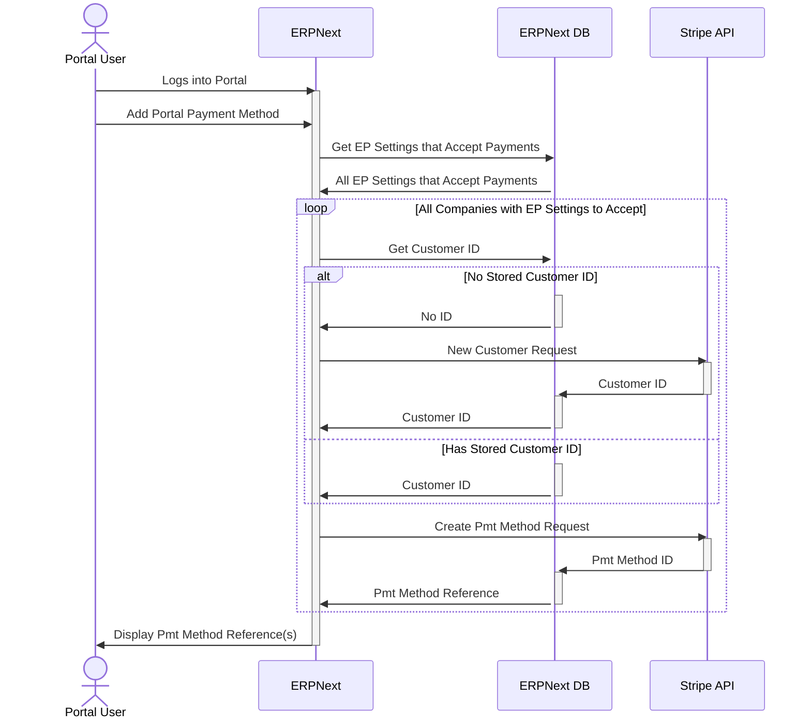

### Stripe: Editing a Portal Payment Method

The following diagram summarizes the interactions between a Customer logged into the ERPNext portal when they want to edit a saved payment method. The form expects the Customer to re-enter all payment method data to update it.

These interactions with the API are identical to what an ERPNext desk user would experience if they edited a payment method from the "Electronic Payments" tab in the Customer record on behalf of the party.

### Stripe: Deleting a Portal Payment Method

The following diagram summarizes the interactions between a Customer logged into the ERPNext portal when they want to delete a saved payment method.

These interactions with the API are identical to what an ERPNext desk user would experience if they deleted a payment method from the "Electronic Payments" tab in the Customer record on behalf of the party.

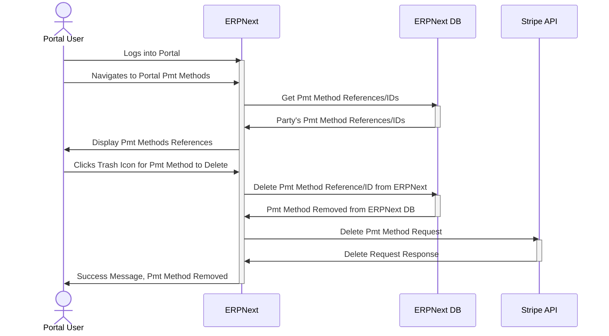

### Stripe: Applying a Portal Payment Method to Pay a Sales Invoice from the Portal

The following diagram summarizes the interactions between a Customer logged into the ERPNext portal when they want to apply a saved payment method to pay an outstanding Sales Invoice.

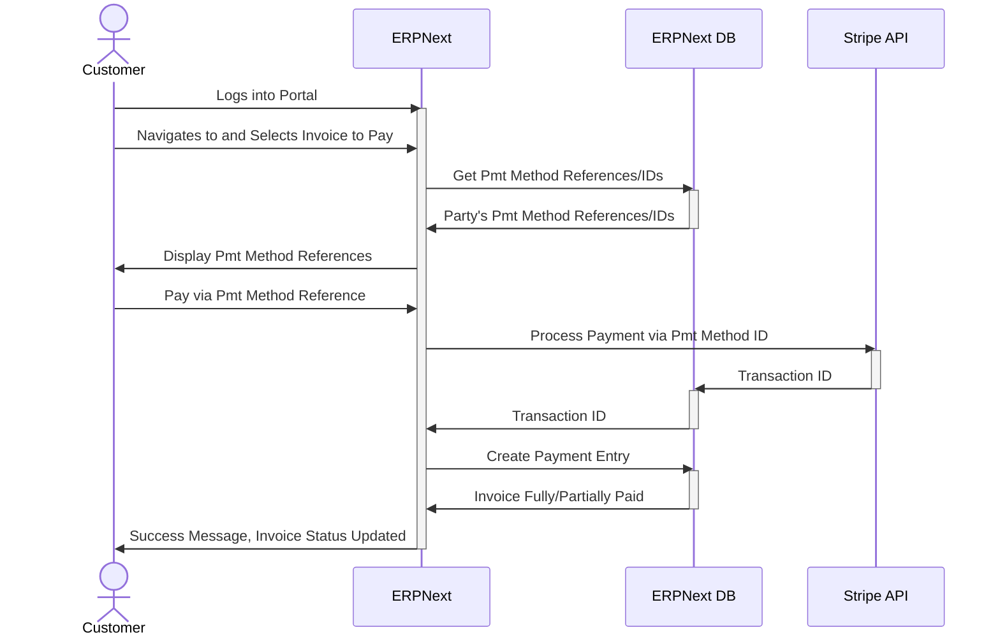

### Stripe: Applying a Portal Payment Method to Satisfy a Sales Invoice as an ERPNext Desk User

The following diagram summarizes the interactions between an ERPNext desk user logged into ERPNext when they want to apply a party's saved payment method to satisfy an outstanding Sales Invoice.

From the Invoice, the desk user can also add a new payment method and choose to save only, save and process payment, or only temporarily save until the payment goes through, then remove it from ERPNext.

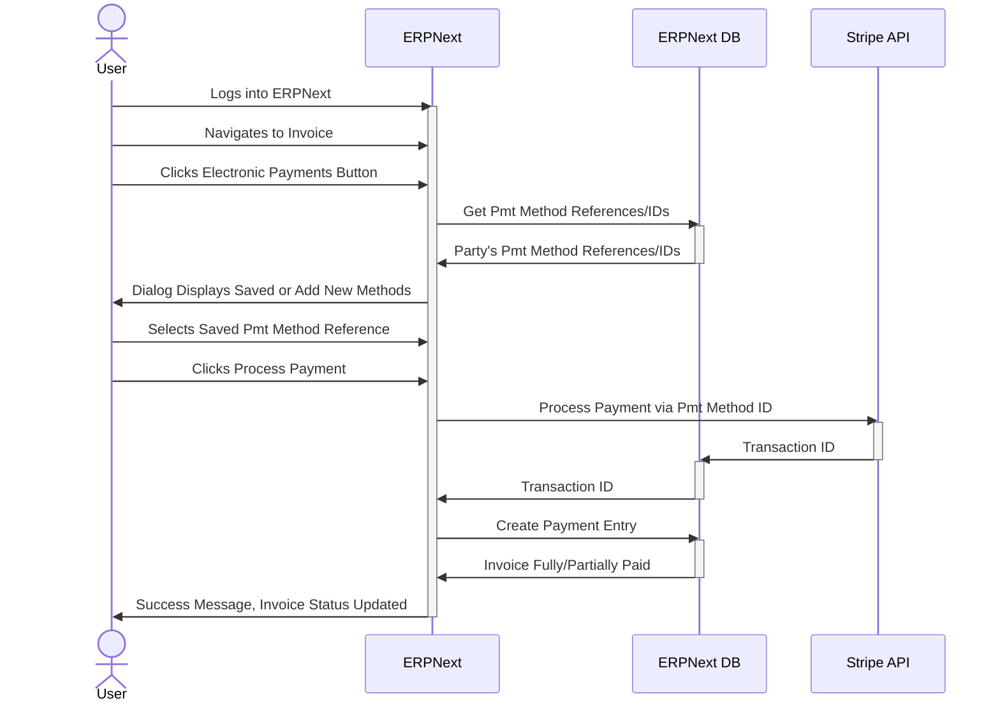

## Wise

Wise is available as a provider to send payments.

| Action | ERPNext Desk User | Customer Portal User | Supplier Portal User |
| :----: | :----------: | :------: | :------: |
| Add Pmt Method | ✅ | ❌ | ✅ |
| Edit Pmt Method | ❌ | ❌ | ❌ |
| Delete Pmt Method | ✅ | ❌ | ✅ |
| Pay Sales Invoice | ❌ | ❌ | ❌ |
| Pay Purchase Invoice | ✅ | ❌ | ❌ |

### Wise: Adding a Portal Payment Method

The following diagram summarizes the interactions between a Supplier logged into the ERPNext portal and the Wise API when they add a new Portal Payment Method. These interactions with the API are identical to what an ERPNext desk user would experience if they added a payment method from the "Electronic Payments" tab in the Supplier record on behalf of the party.

Wise does not use profile IDs for a party. Instead, it creates independent "recipients" for each payment method.

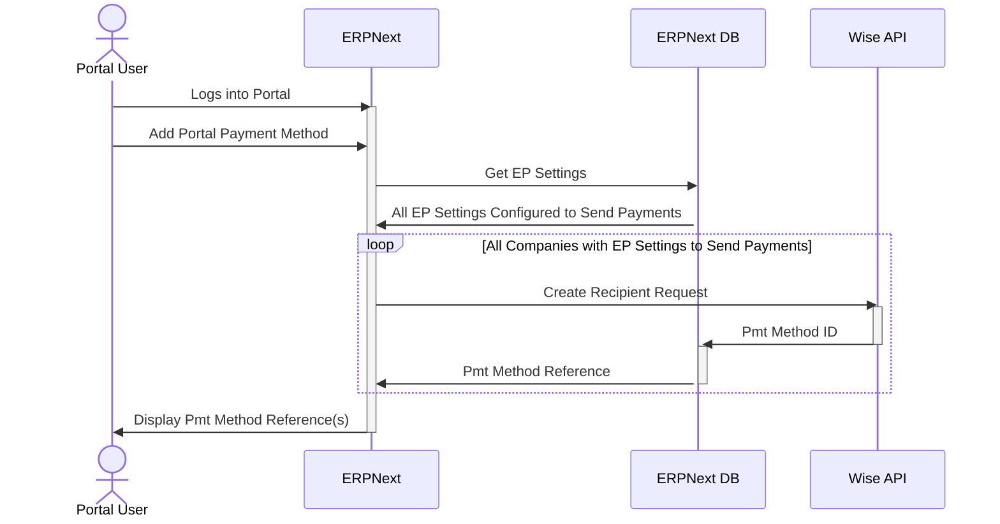

### Wise: Editing a Portal Payment Method

Wise doesn't allow for editing a payment method. Instead, the user needs to delete it and add it as a new payment method with any changes.

### Wise: Deleting a Portal Payment Method

The following diagram summarizes the interactions between a Supplier logged into the ERPNext portal when they want to delete a saved payment method.

These interactions with the API are identical to what an ERPNext desk user would experience if they deleted a payment method from the "Electronic Payments" tab in the Supplier record on behalf of the party.

### Wise: Send Payment to a Portal Payment Method to Pay a Purchase Invoice as an ERPNext Desk User

The following diagram summarizes the interactions between an ERPNext desk user logged into ERPNext when they want to send payment to a Supplier's saved payment method to pay an outstanding Purchase Invoice.

Wise has a slightly different process compared to the other providers - instead of a single payment request, there are separate requests to create a quote, then set up a transfer. Wise does not allow funding a transfer via the API, unless there's a direct debit account set up. If that's the case, the Electronic Payments app will attempt the final fund transfer step as a batch transfer with direct debit.

If the user doesn't want to set up or use direct debit to fund all transfers, then they will need to go to the Wise website and perform the final funding step there.

#### No Direct Debit Account is Configured in Wise or Electronic Payments Settings

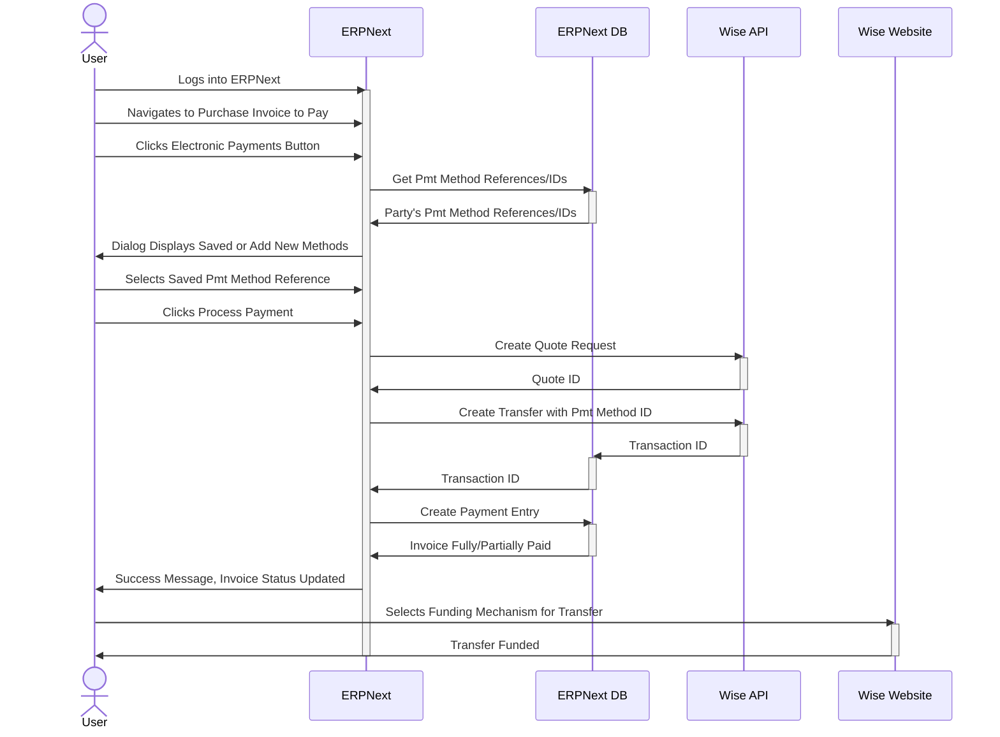

#### Direct Debit Account is Configured in Wise and Electronic Payments Settings

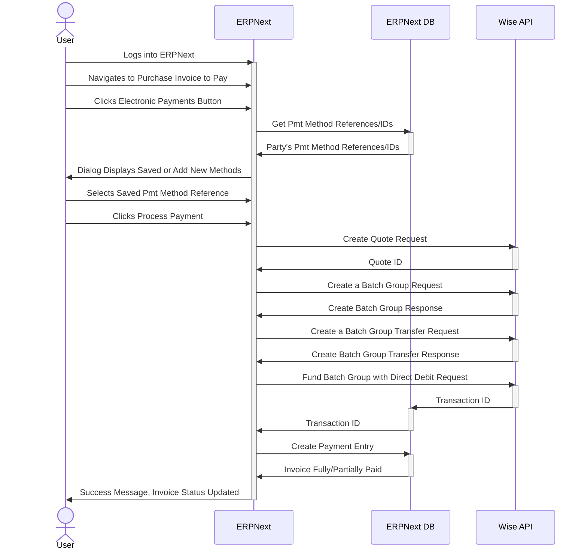
